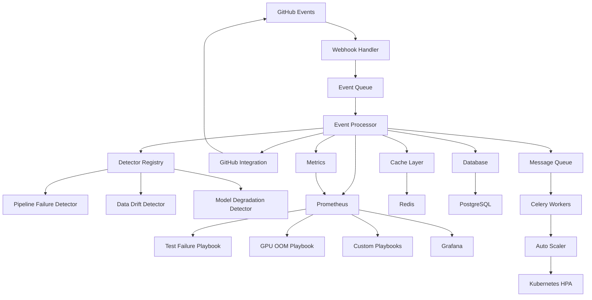

# Self-Healing MLOps Bot Architecture

## Overview

The Self-Healing MLOps Bot is a cloud-native, autonomous system designed to detect and repair ML pipeline failures, data drift, and performance degradation. It uses an event-driven architecture with intelligent playbooks for automated remediation.

## System Architecture

## Core Components

### 1. Event Processing Layer

**Webhook Handler (`web/app.py`)**
- Receives GitHub webhook events
- Validates signatures and rate limits
- Queues events for processing

**Event Processor (`core/bot.py`)**
- Main orchestration engine
- Coordinates detectors and playbooks
- Manages execution context

### 2. Detection Layer

**Base Detector (`detectors/base.py`)**
- Abstract interface for all detectors
- Standardized issue reporting format

**Pipeline Failure Detector (`detectors/pipeline_failure.py`)**
- Monitors CI/CD pipeline failures
- Categorizes failure types (test, build, deployment)
- Extracts error patterns from logs

**Data Drift Detector (`detectors/data_drift.py`)**
- Statistical drift detection (KS test, PSI, JS divergence)
- Configurable thresholds and windows
- Adaptive monitoring based on data patterns

**Model Degradation Detector (`detectors/model_degradation.py`)**
- Performance metric monitoring
- Baseline comparison and trend analysis
- Anomaly detection for model metrics

### 3. Remediation Layer

**Playbook System (`core/playbook.py`)**
- Declarative repair workflows
- Action ordering and retry logic
- Timeout and error handling

**Built-in Playbooks**
- Test Failure Handler: Analyzes logs, fixes common errors
- GPU OOM Handler: Reduces batch size, enables checkpointing
- Extensible plugin system for custom playbooks

### 4. Integration Layer

**GitHub Integration (`integrations/github.py`)**
- GitHub App authentication (JWT + installation tokens)
- Repository operations (file read/write, PR creation)
- Webhook validation and processing

### 5. Performance Layer

**Adaptive Caching (`performance/caching.py`)**
- Multi-level cache (local + Redis)
- Intelligent TTL based on access patterns
- Cache warming and invalidation strategies

**Concurrency Management (`performance/concurrency.py`)**
- Adaptive thread/process pools
- Resource monitoring and scaling
- Circuit breaker pattern for fault tolerance

**Auto-scaling (`performance/auto_scaling.py`)**
- Predictive scaling based on historical patterns
- Multi-metric scaling policies
- Kubernetes HPA integration

### 6. Observability Layer

**Structured Logging (`monitoring/logging.py`)**
- Contextual logging with request tracing
- Audit trail for all bot actions
- Performance and security event logging

**Metrics Collection (`monitoring/metrics.py`)**
- Prometheus metrics for all components
- Custom metrics for business logic
- Health checks and alerting

**Health Monitoring (`monitoring/health.py`)**
- Component health checks
- Dependency monitoring
- Graceful degradation strategies

### 7. Security Layer

**Input Validation (`security/validation.py`)**
- Comprehensive input sanitization
- Rate limiting and abuse prevention
- Pattern-based security scanning

**Secrets Management (`security/secrets.py`)**
- Encryption at rest and in transit
- Secret scanning and detection
- Secure configuration management

## Data Flow

### 1. Event Ingestion
1. GitHub sends webhook to `/webhook` endpoint
2. Request is validated (signature, rate limits)
3. Event is queued for asynchronous processing
4. Background worker picks up event

### 2. Issue Detection
1. Event context is created with repository metadata
2. Relevant detectors are selected based on event type
3. Each detector analyzes the event for potential issues
4. Issues are classified by type and severity

### 3. Automated Remediation
1. Applicable playbooks are identified for detected issues
2. Playbooks execute ordered sequences of actions
3. Actions can modify files, create PRs, trigger workflows
4. Results are logged and metrics are updated

### 4. Feedback Loop
1. Bot monitors the effectiveness of applied fixes
2. Success/failure rates inform future decision making
3. Machine learning models adapt to repository patterns
4. Continuous improvement through data-driven insights

## Scalability Features

### Horizontal Scaling
- Stateless API servers behind load balancer
- Worker pool auto-scaling based on queue depth
- Database connection pooling and read replicas

### Vertical Scaling
- Adaptive resource allocation per component
- Memory and CPU optimization based on workload
- Intelligent caching to reduce compute requirements

### Geographic Distribution
- Multi-region deployment support
- Edge caching for GitHub API responses
- Regional webhook endpoints for reduced latency

## Security Architecture

### Defense in Depth
1. **Network Security**: TLS encryption, private networking
2. **Application Security**: Input validation, output encoding
3. **Authentication**: GitHub App with minimal permissions
4. **Authorization**: Repository-level access controls
5. **Data Security**: Encryption at rest, secure key management

### Compliance
- SOC 2 Type II controls
- GDPR data protection measures
- Audit logging and retention policies
- Regular security assessments

## Deployment Architecture

### Kubernetes Native
- Cloud-agnostic deployment model
- Auto-scaling and self-healing infrastructure
- Rolling updates with zero downtime
- Resource quotas and limits

### Multi-Environment Support
- Development, staging, production environments
- Environment-specific configuration management
- Automated promotion pipelines
- Blue-green deployment strategies

## Performance Characteristics

### Throughput
- **Events**: 1000+ webhooks/minute per instance
- **Detectors**: <500ms average detection time
- **Playbooks**: <2 minutes average execution time
- **API**: <100ms response time for health checks

### Reliability
- **Availability**: 99.9% uptime SLA
- **Error Rate**: <0.1% for core operations
- **Recovery Time**: <5 minutes for component failures
- **Data Durability**: 99.999999999% (11 9's)

### Scalability Limits
- **Repositories**: 10,000+ active repositories
- **Concurrent Events**: 500+ simultaneous processing
- **Storage**: Petabyte-scale data retention
- **Geographic**: Multi-region deployment support

## Future Enhancements

### Machine Learning Integration
- Predictive failure detection using historical data
- Intelligent playbook selection based on context
- Automated hyperparameter tuning for models
- Reinforcement learning for optimization strategies

### Extended Platform Support
- GitLab and Bitbucket integration
- Jenkins and CircleCI pipeline support
- AWS, GCP, Azure cloud platform integration
- Kubernetes operator for simplified deployment

### Advanced Monitoring
- Real-time anomaly detection
- Predictive capacity planning
- Cost optimization recommendations
- Security threat detection and response